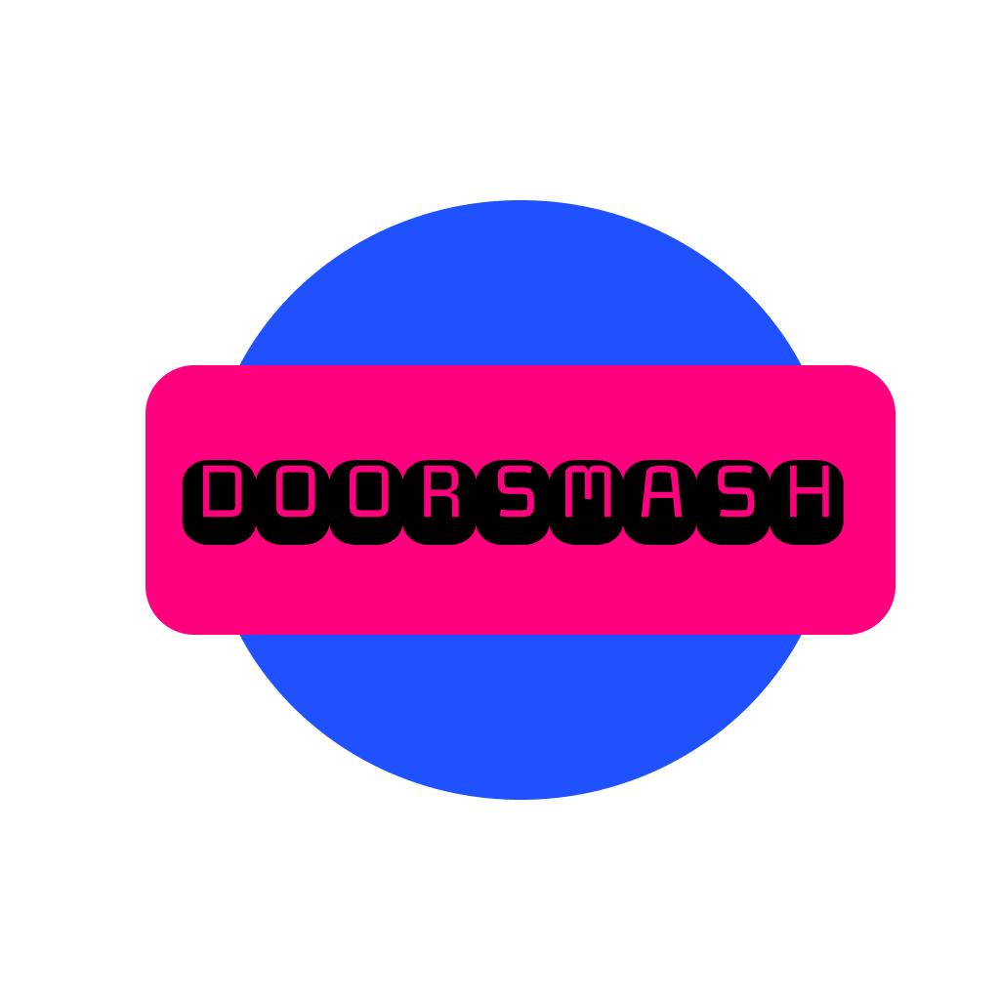

# DoorSmash

DoorSmash is a gaming supplies e-commerce application designed to provide users with a seamless shopping experience for gaming-related products.

## Features

- **Product Listing**: Browse a wide range of gaming supplies, including consoles, accessories, and games.
- **Shopping Cart**: Add desired items to the cart for future purchase.
- **User Authentication**: Secure login and registration system to manage user accounts.
- **Order Management**: Track your orders and view order history.
- **Search Functionality**: Easily search for products using keywords.

## Installation

Follow the steps below to install and run the application locally:

1. **Clone the repository**:
    ```bash
    git clone https://github.com/adithya1770/DoorSmash.git
    cd DoorSmash
    ```

2. **Install dependencies**:
    ```bash
    npm install
    ```

3. **Set up environment variables**:
    Create a `.env` file in the root directory and add the required configuration:
    ```env
    PORT=5000
    MONGO_URI=your_mongodb_connection_string
    JWT_SECRET=your_jwt_secret
    ```

4. **Run the application**:
    Start the development server:
    ```bash
    npm start
    ```
    The application will run at `http://localhost:5000`.

## Tech Stack

* **Frontend**:
    * React.js: For building a dynamic user interface.
    * Tailwind CSS: For styling and responsive design.

* **Backend**:
    * Node.js: For building the server-side logic.
    * Express.js: For handling routes and middleware.

* **Database**:
    * MongoDB: For storing product and user data.

* **Authentication**:
    * JSON Web Tokens (JWT): For secure user authentication.

* **Tools**:
    * Git: For version control.
    * npm: For managing dependencies.

## Contributing

Feel free to fork this repository and submit pull requests for enhancements or bug fixes.

## License

This project is licensed under the MIT License.
